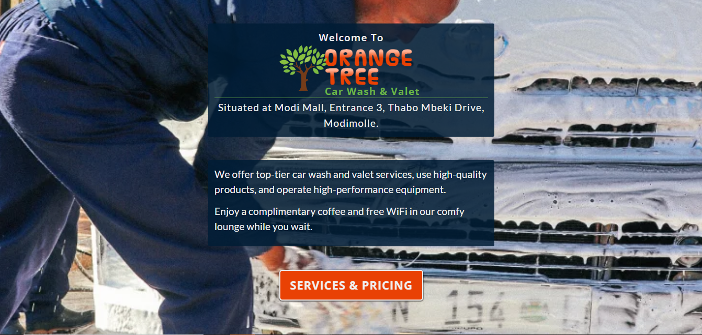

# orangeTree044

[orangeTree044](https://svdwebtech.github.io/orangeTree044/) &rarr; A website for Orange Tree Marketing to promote their business Orange Tree Car Wash & Valet in Modimolle.

## Table of contents

- [orangeTree044](#orangetree044)
  - [Table of contents](#table-of-contents)
  - [Overview](#overview)
    - [Screenshot](#screenshot)
    - [Background] (#background)
    - [Links](#links)
  - [My process](#my-process)
    - [Built with](#built-with)
    - [What I learned](#what-i-learned)
  - [Author](#author)
  - [Acknowledgments](#acknowledgments)

## Overview

### Screenshot

### Background

Estelle approached me to design and develop a new website for their car wash business, Orange Tree Car Wash and Valet.  She also entrusted me with the social media marketing of the business.

### Links

- Live Site URL: [(https://svdwebtech.github.io/orangeTree044/)](https://svdwebtech.github.io/orangeTree044/)

## My process

### Built with

I built this with html, css, sass and js.  I also made use of a widget on elfsight.

### What I learned

A project is never finished.  There is always something that can be improved upon.  Listen to your client, they have good ideas about their product.

## Author

- Website - [Schalk van Dyk](https://www.schalkvandyk.com)
- LinkedIn Profile - [@SVDwebtech](https://www.linkedin.com/in/SVDwebtech/)
- GitHub Profile - [@SVDwebtech](https://github.com/SVDwebtech/)
- Facebook Page - [@SVDwebtech](https://web.facebook.com/SVDwebtech/)
- Twitter Profile - [@SVDwebtech](https://twitter.com/SVDwebtech/)

## Acknowledgments

Thank you Estelle at Orange Tree Marketing for the trust you placed in me to design and develop this website.   